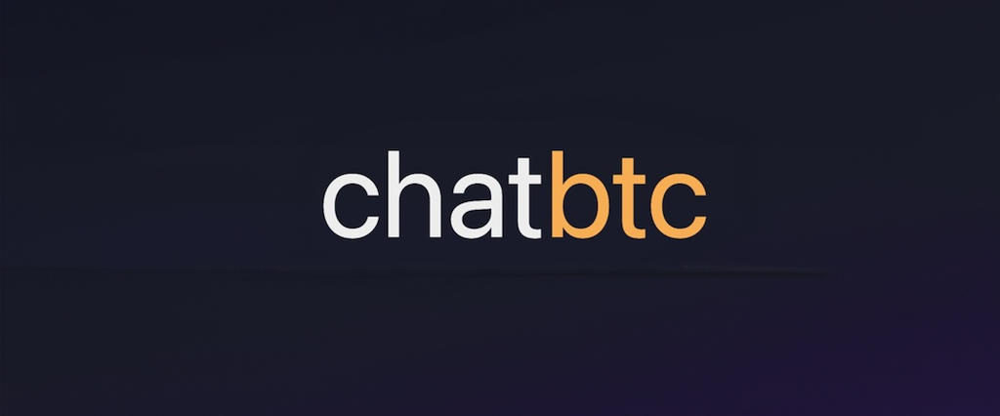

# Welcome to ChatBTC

This is powered by the same backend at [bitcoinsearch.xyz](https://bitcoinsearch.xyz/), but here you can chat with your favorite sources and authors.

---

## Getting Started

This project is a chat application built using Next.js, Chakra UI. These instructions will get you a copy of the project up and running on your local machine for development and testing purposes.

### Installing

1. Clone the repository
```sh
git clone git@github.com:bitcoinsearch/chat-btc.git
```

2. Install NPM packages
```bash
npm run dev
# or
yarn dev
# or
pnpm dev
```

3. Add your API keys to a `.env.local` file in the root directory including:

```
ES_URL=
ES_AUTHORIZATION_TOKEN=
OPENAI_API_KEY=
```

## Usage

Visit `http://localhost:3000` in your browser to see the application running.

You can start editing the page by modifying `pages/index.tsx`. The page auto-updates as you edit the file.

[API routes](https://nextjs.org/docs/api-routes/introduction) can be accessed on `http://localhost:3000/api/hello`. This endpoint can be edited in `pages/api/hello.ts`.

The `pages/api` directory is mapped to `/api/*`. Files in this directory are treated as [API routes](https://nextjs.org/docs/api-routes/introduction) instead of React pages.

## Built With

- [Next.js](https://nextjs.org/)
- [Chakra UI](https://chakra-ui.com/)

## License

This project is licensed under the MIT License - see the [LICENSE.md](LICENSE.md) file for details.

## Feedback and Contributions

...are welcome!
